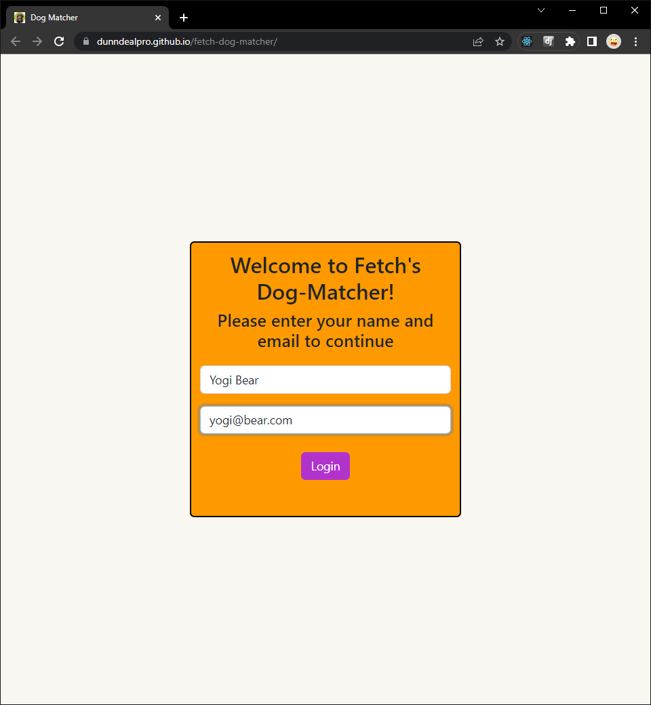
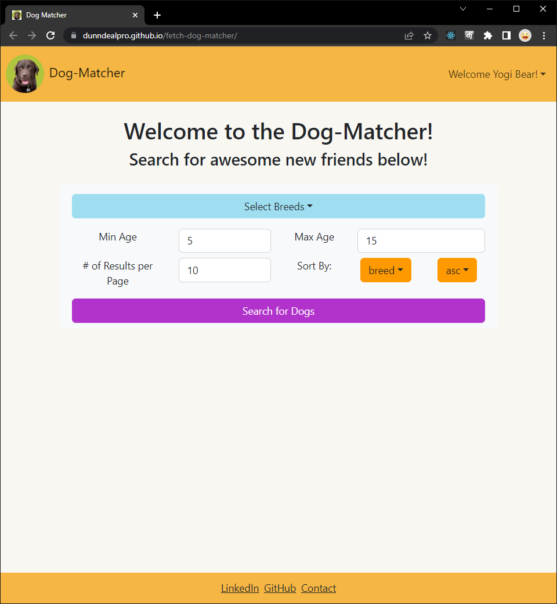
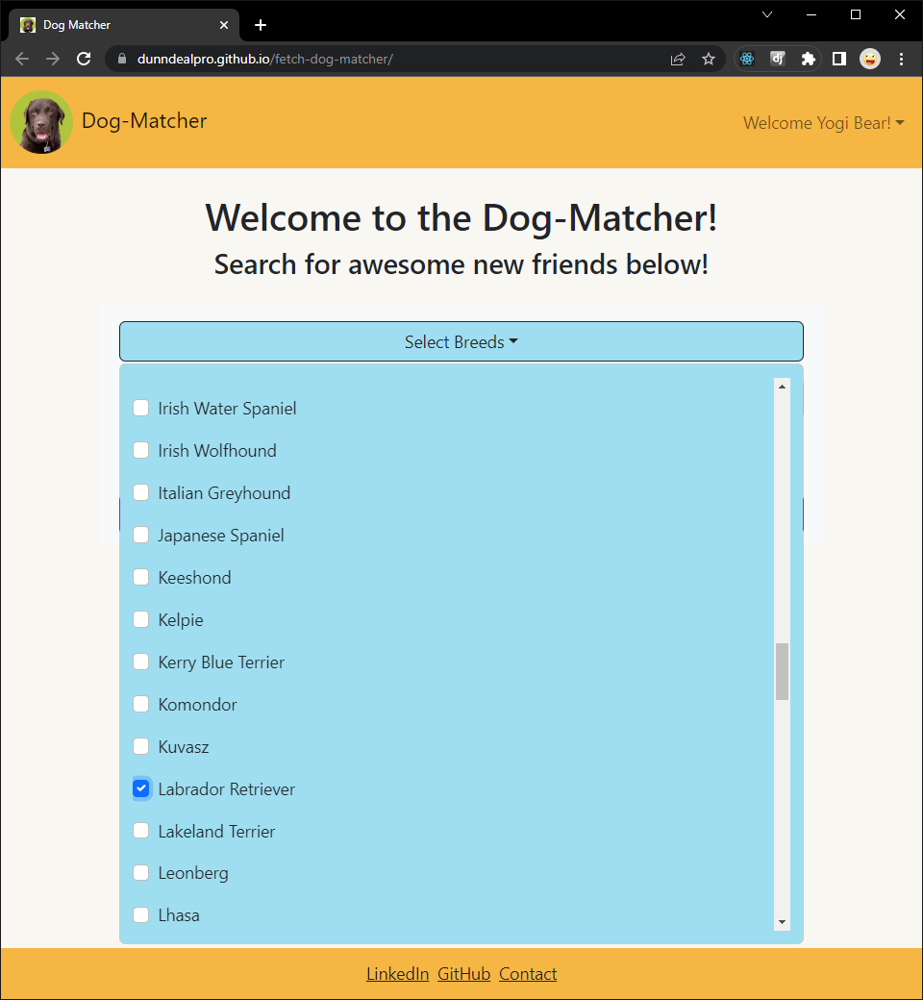
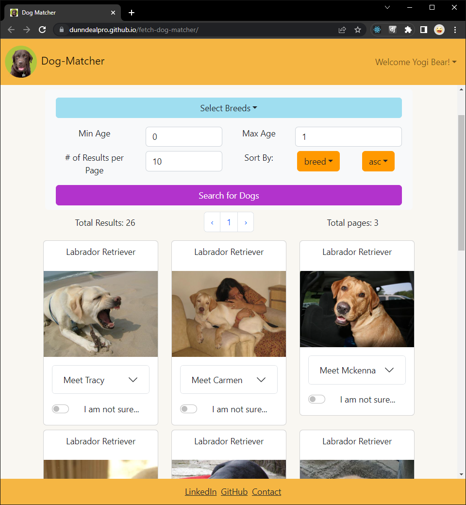
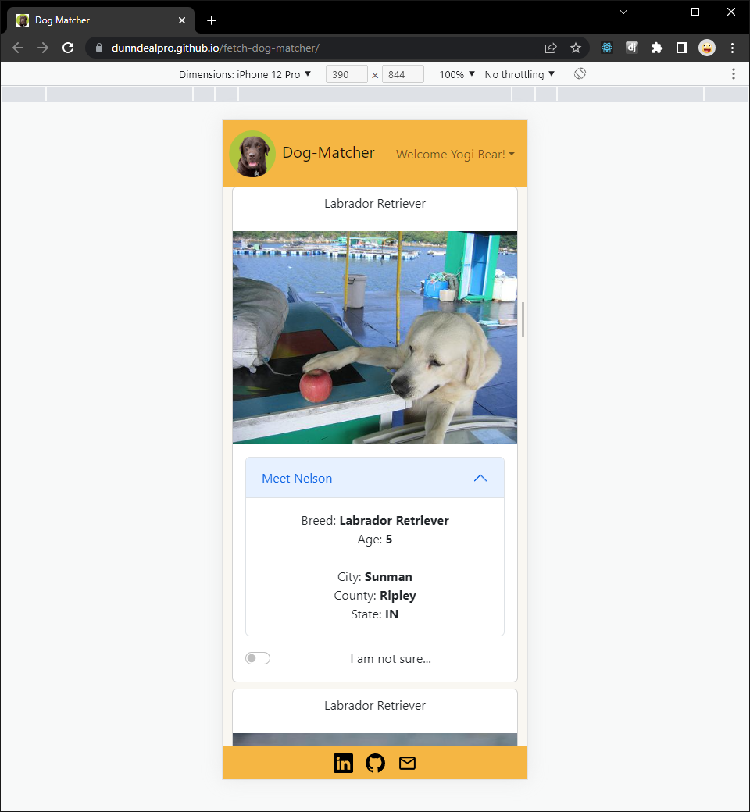
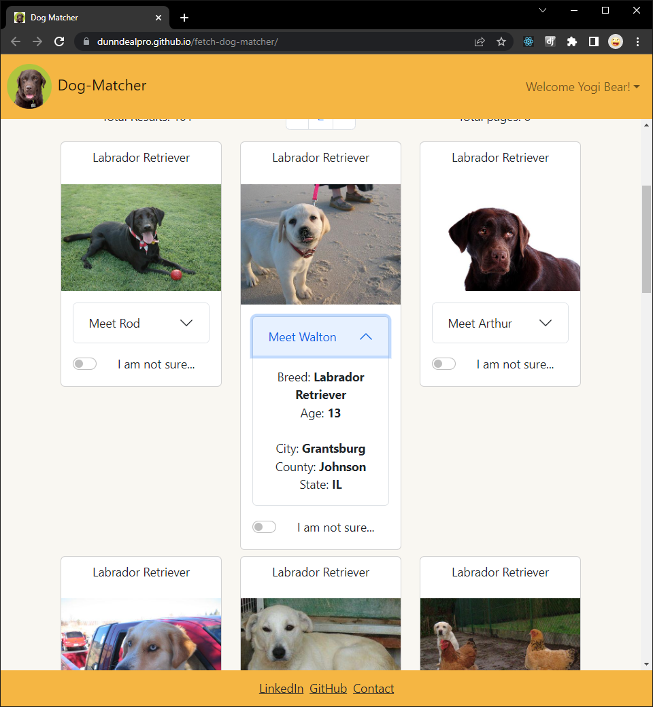
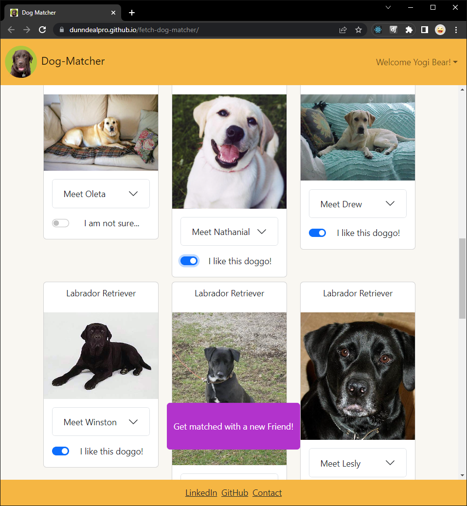
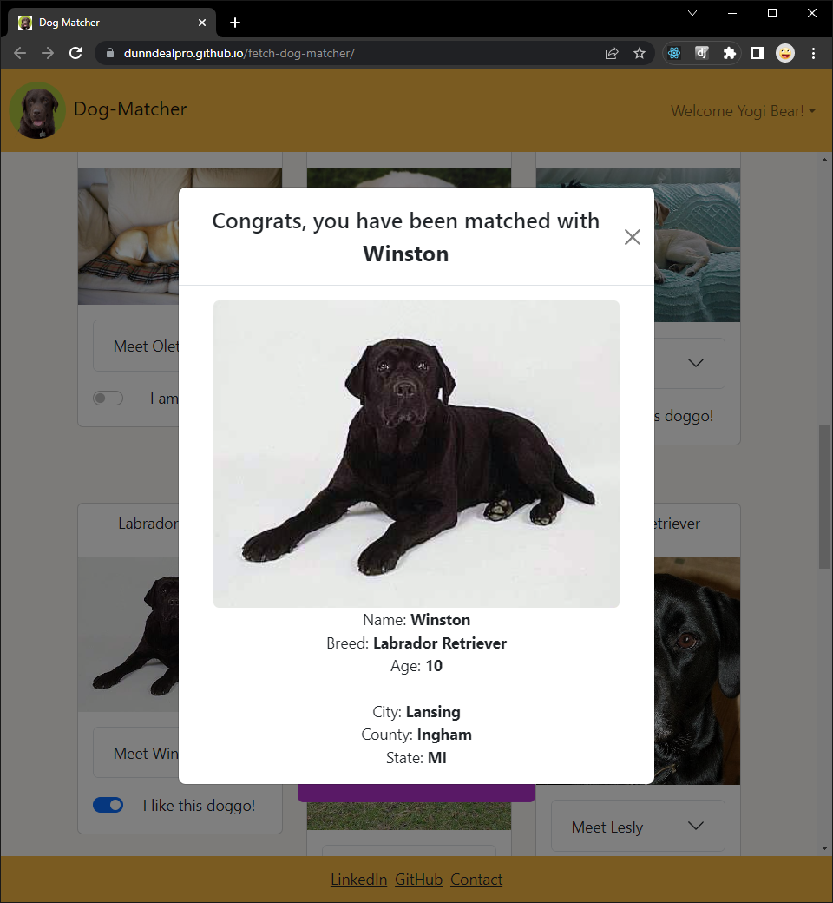

# Fetch - Dog Matcher Take Home Project

[Link to Deployed App](https://dunndealpro.github.io/fetch-dog-matcher/)

This project allows a user to login and search for available shelter dogs.  A user is able to filter available dogs by selecting one or more breeds and is able to filter by minimum and maximum age.  The user is also able to select the number of results to view per page, as well as able to sort the results by either, breed, age, or name, in ascending or descending order.  

After results are generated, a user can scroll through the results and is able to click to see more details about the results.  If a user likes any of the results, they are able to select a switch that will indicate they like the result.  After one or more result is 'liked' a button appears and upon clicking, a result from the user's liked selections will pop up.  

[Link to Deployed App](https://dunndealpro.github.io/fetch-dog-matcher/)

Technologies used: React, TypeScript, HTML, CSS, React-Bootstrap

This project was bootstrapped with [Create React App](https://github.com/facebook/create-react-app).
